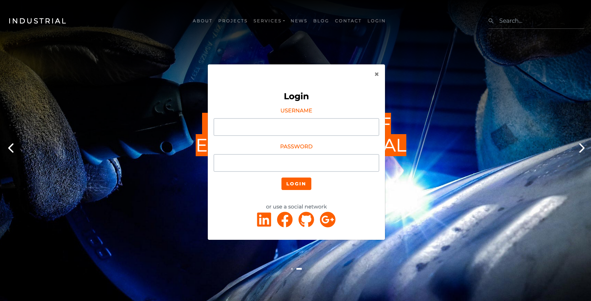

Bootstrap Navbar Social Login for Jahia Industrial Template Set
================

This module overwrite the login button from the bootstrap4 Navbar with a Social Login Modal

### MINIMAL REQUIREMENTS
* Jahia 8.0.2.0
* Jahia Oauth 3.2.0

### INSTALLATION
Download the jar and deploy it on your instance, then activate the module on the site you wish to use.  
You will also need to download connectors and actions (mappers or providers) to use this module.

### HOW TO USE IT?
* Go to your `site > site settings > Jahia Authentication`
* In the panel you will see the list of OAuth connectors that are available for your site and if you open the card you will see the parameters to fill in order to activate and use it
* You will need to go to the open authentication website of your connector to setup an app and get the parameters
* Once this is done a new button will appear `Actions` and if you click on it you will access to the action modules part
* On this part you can activate as many action modules type mapper as you which but you can only activate one provider
* Create a mapping for the provider
* Then in edit mode overwrite the view of your bootstrap4 navbar
* Publish your site
* Your users can now connect using open authentication

### AVAILABLE CONNECTORS
- Google open authentication 
- LinkedIn open authentication 
- Facebook open authentication 
- GitHub open authentication 

### Available Views
On your Boostrap4 Navbar you can either select:
- augmentedSearch.SocialLogin (compatible with standard Jahia Module Augmented Search UI)
- industrial.SocialLogin (Overwrite the standard Industrial Template Navbar)

### Screenshot

